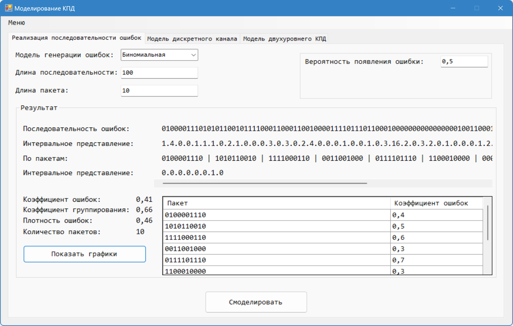
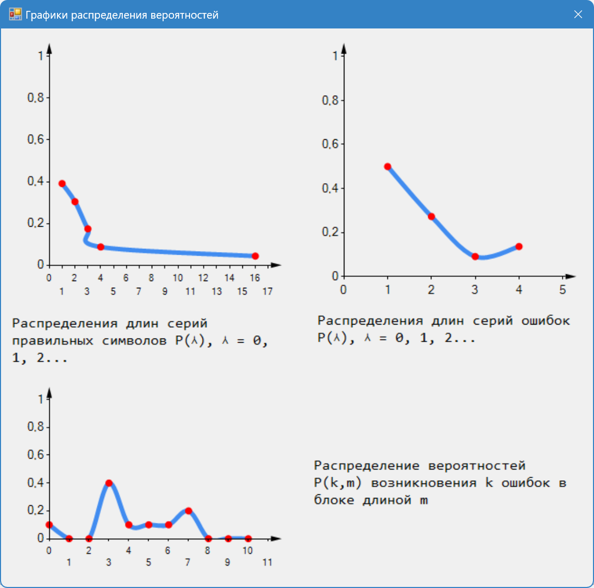
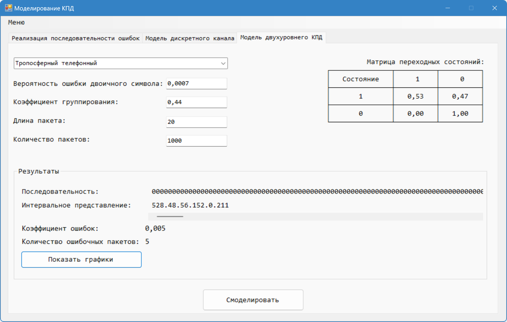
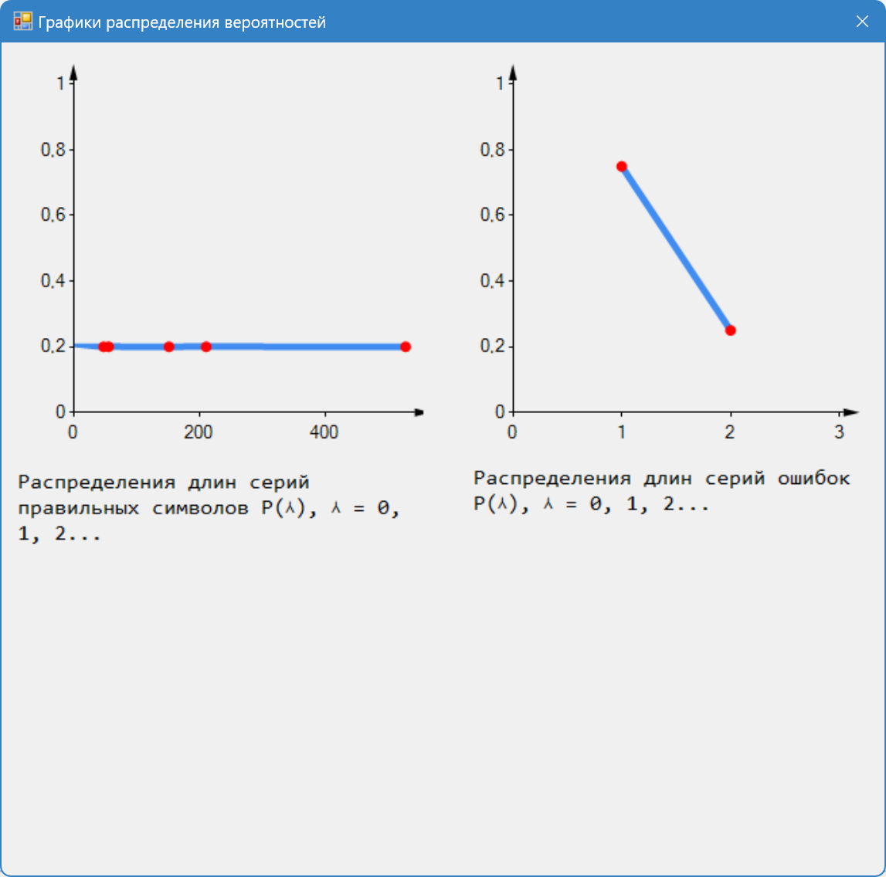

# ChannelModeling

## Описание

ChannelModeling - это приложение для моделирования каналов связи, разработанное на C#. Позволяет анализировать и моделировать различные аспекты каналов связи, включая генерацию помех и анализ характеристик канала.

## Особенности

- 📊 Моделирование различных типов каналов связи
- 🔄 Генерация помех и шумов
- 📈 Анализ характеристик канала
- 📉 Визуализация результатов
- 🎯 Точные математические модели
- 🔍 Детальный анализ параметров
- 📱 Удобный пользовательский интерфейс

## Галерея






## Установка

1. Убедитесь, что у вас установлен .NET Framework 4.7.2 или выше
2. Клонируйте репозиторий:
```bash
git clone https://github.com/almost-wizard/ChannelModeling.git
cd ChannelModeling
```

3. Откройте решение в Visual Studio:
   - Откройте файл `ChannelModeling.sln`
4. Соберите решение:
   - Выберите конфигурацию Release
   - Нажмите Build -> Build Solution

## Системные требования

- .NET Framework 4.7.2+
- Visual Studio 2019/2022 (для разработки)
- Windows 7/8/10/11
- 4GB RAM
- 500MB свободного места на диске

## Структура проекта

```
ChannelModeling/
├── App/                    # Основные компоненты приложения
├── Controls/               # Пользовательские элементы управления
├── Extension/              # Расширения и утилиты
├── Forms/                  # Формы пользовательского интерфейса
├── InterferenceGenerator/  # Модели генераторов помех
└── Objects/                # Модели данных
```

## Пример использования

```csharp
// Пример кода для работы с генератором помех
var interferenceGenerator = new InterferenceGenerator();
var result = interferenceGenerator.GenerateInterference(parameters);
```

---

⭐ Не забудьте поставить звезду репозиторию, если вам понравился проект!
